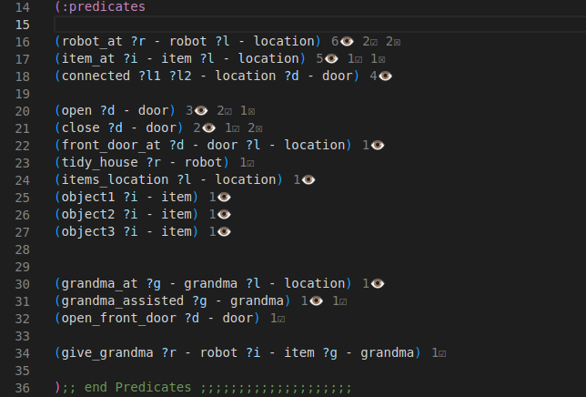
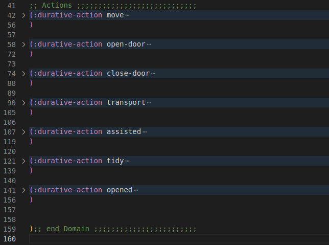
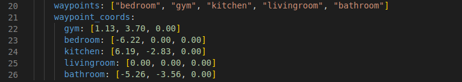
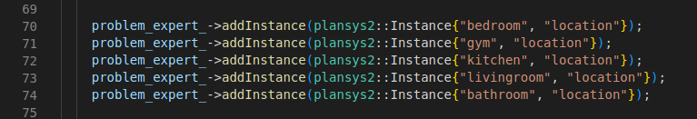
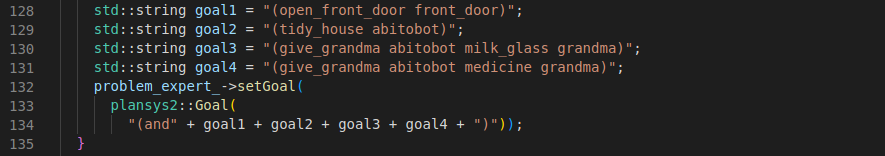

[](https://classroom.github.com/a/j9y_86cr)
# plansys2_gpsr

# Ejercicio 4 de Planificación y Sistemas Cognitivos 2023

En grupos de 4, haced una aplicación en ROS 2 usando PlanSys2 que use el dominio de la [Práctica 3](https://github.com/Docencia-fmrico/planning-exercise/blob/main/README.md). El robot debe poder realizar en un simulador, navegando con Nav2, goals similares a los siguientes:

(ordena_casa robot1)
(abrir_puerta puerta_principal)
(dar robot1 vaso_leche abuelita)
(dar robot1 medicina abuelita)

Puntuación (sobre 10):   
* +5 correcto funcionamiento en el robot simulado.
* +2 Readme.md bien documentado con videos.
* +2 CI con Test de los nodos BT
* -3 Warnings o que no pase los tests.

---

<div align="center">
</a>
</a>
</div>

---

## Technical aspects

### **Related to the domain defined**

We have adapted the domain used within the Practice number 3, mentioned before. The following changes are noteworthy:

- Some of the old predicates were keep as they were, meanwhile others were modificated or supressed due to the requirements of this practice
- Certain actions have also been removed or modified. For example, pick and drop for object interactions have been condensed into a single action called **transport**, controlled by a behaviour tree.
- The predicates and actions relating to interactions with the Grandma have been adapted.

Hereafter we can see the predicates used within this practice:
<p align="center"> 
       
</p>

And here we look at the actions declared in the problem domain, all of which are **durative actions**:
<p align="center"> 
       
</p>

Those predicates and actions that handled interactions with doors have been kept in the problem domain. A predicate has also been added to indicate the location of the **main door**, and another one to open it, as we can see in the images above.

### **Related to general control**

For the method used to **open doors**, as well as the robot's displacement and interactions with objects, we have used a **behavior-tree** that implements the action. Although the existence of predicates which differentiate the main door from the other ones, the opening procedure is the same.

To **interact with the Grandma**, since the robot was in charge of **bringing her certain objects**, the same **transport** method was used as when rearranging the items of the house then tiding it, also controlled by a behaviour tree.

### **Other major aspects**

When navigating, we have implemented the following waypoint list that the robot navigates through.
<p align="center"> 
       
</p>

Since the coordinates of the points are only defined in the [params-yaml](nc_bt_plansys2/config/params.yaml) file, it is easy to define new ones. However, in case you want to add new navigation points, you would also have to include them in the [controller node](nc_bt_plansys2/src/assisted_controller_node.cpp), when declaring the initial knowledge of the robot:
<p align="center"> 
       
</p>

When the robot is performing some of the non-visible actions, such as opening doors or assisting the Grandma, the kobuki can be seen waiting still while it prints out certain messages corresponding to whatever it is doing at the moment, which can also be noticed in one of the videos below.

The practice resolution has been made with **continuous integration**

---

## Start-up

### To test the package with **simulated navigation** by terminal messages

- Start the launcher of our package
```
ros2 launch nc_bt_plansys2 nc_bt_plansys2_launch.py
```
- Initialize simulated navigation
```
ros2 run nc_bt_plansys2 nav2_sim_node
```
- Run the control node of the robot
```
ros2 run nc_bt_plansys2 assisted_controller_node
```

If we have followed the steps correctly, we will see that in the terminal where we have executed the launcher of our package, messages of the non-visible actions that the robot is performing start to be printed. This also happens when we test the code in the Gazebo simulator. On the other hand, the navigation messages can be seen in the terminal where we have started the navigation node.

<div align="center">
</a>
</div>

### To test the package **navigating with Gazebo**.

The same steps as above should be followed, with the exception of launching Gazebo navigation, correctly configured for the kobuki robot, as follows:
- Lanzar el simulador de ir_robots con el siguiente comando en primer lugar:
- Launch the ir_robots simulator with this command firstly
```
ros2 launch ir_robots simulation.launch.py
```
- It is necessary to replace the dummy navigation command:
```
ros2 run nc_bt_plansys2 nav2_sim_node
```
with one of the following two:
```
ros2 launch ir_robots navigation.launch.py
ros2 launch ir_robots navigation_launch.py
```
being the first of them, the one which opens the visualisation with rviz

If everything has gone correctly, we will see the kobuki start to navigate through the house, and the relevant action messages will be printed as they are performed, on the terminal where the laucher of our package was.

<div align="center">
</a>
</div>

---

## Goal tests performed

The tasks we assigned to the robot to test the planning were as follows:
- Tidy up the house, having to reposition different objects.
- To look after the Grandma, bringing her the things she asked for.
- Opening, in addition to the strictly necessary doors, the front door of the house.

These objectives, included in the [assisted_controller_node.cpp](nc_bt_plansys2/src/assisted_controller_node.cpp), as we can see below, are properly fulfilled by the kobuki when we launch the simulation.

<p align="center"> 
       
</p>

In addition, we also have a full video of how our package works within the Gazebo simulator:

* [**Kobuki simulation full video**](https://www.youtube.com/watch?v=6Ep7bwbBd7Q)

---

## Style tests carried out

To verify that the code passes the roslint and other tests correctly, if modifications have been made, the following commands should be executed from the workspace

```
colcon build --packages-select nc_bt_patrolling
colcon test --packages-select nc_bt_patrolling
```

During the practice we have been making sure that all the code periodically passed the tests, if we execute both commands mentioned above immediately after having made the clone of the repository we will see that all the tests pass successfully

---

## Authors

Practice carried out by URJC students and members of the NocomPila team:

* **Javier Mayorga Caro** - [javioled](https://github.com/javioled)
* **Marvin Pancracio Manso** - [mpancracio2020](https://github.com/mpancracio2020)
* **Moisés Muñoz Suárez** - [mmunozs2020](https://github.com/mmunozs2020)
* **Víctor Bárcena Mena** - [vbarcena2020](https://github.com/vbarcena2020)

You can also find more information about all our projects in our [GitHub](https://github.com/orgs/Docencia-fmrico/teams/nocompila)

Also you can go to our [youtube channel](https://www.youtube.com/@nocompila) to watch more videos

---

## About license

This project is under license, for more details see the file [LICENSE](LICENSE) 

---
